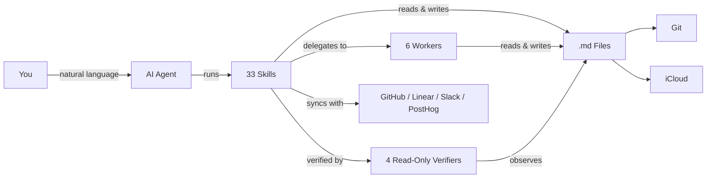
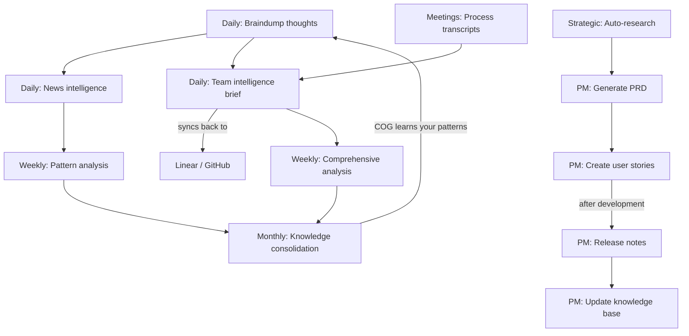

# COG: The Agentic Second Brain That Actually Self-Evolves

**Cognition + Obsidian + Git** — A self-evolving second brain powered by AI agents, markdown files, and version control. No database, no vendor lock-in — just `.md` files that think.

[Quick Start](#quick-start) | [Skills](#skills) | [Features](#features-at-a-glance) | [FAQ](#faq) | [SETUP.md](SETUP.md)

> Works with [Claude Code](https://claude.ai/download) &bull; Antigravity &bull; [Cursor](https://cursor.com/) &bull; [Kiro](https://kiro.dev/) &bull; [Gemini CLI](https://github.com/google-gemini/gemini-cli) &bull; [OpenAI Codex](https://github.com/openai/codex) &bull; any AI that reads markdown
>
> Inspired by [Garry Tan's gstack](https://github.com/garrytan/gstack) and [gbrain](https://github.com/garrytan/gbrain)



> **New to COG?** Watch the [2-minute walkthrough](https://youtube.com/PLACEHOLDER) to see it in action.

## Quick Start

**1. Clone & enter the repo:**
```bash
git clone https://github.com/huytieu/COG-second-brain.git
cd COG-second-brain
```

**2. Run onboarding in your agent:**

| Agent | Command | How it finds skills |
|---|---|---|
| Claude Code | `code .` → "Run onboarding" | `.claude/skills/` |
| Antigravity | Open folder → "Run onboarding" | `.agents/skills/` + `.agents/rules/cog.md` |
| Cursor | Open folder → "Run onboarding" | `.cursor-plugin/` + `.cursorrules` |
| Kiro | Open folder → "setup COG" | `.kiro/powers/` |
| Gemini CLI | `gemini` → `/onboarding` | `GEMINI.md` + `.gemini/commands/` |
| OpenAI Codex | `codex` → "Run onboarding" | `AGENTS.md` |
| Other agents | Point at `AGENTS.md` → "Run onboarding" | `AGENTS.md` |

**Or install via [skills.sh](https://skills.sh):**
```bash
npx skills add huytieu/COG-second-brain
```

Done — COG is personalized and ready in ~2 minutes. See [SETUP.md](SETUP.md) for optional config (Git sync, iCloud, Obsidian Tasks, etc.).

## Agent Support Matrix

COG ships a **full Claude Code surface**, a **full Antigravity surface**, plus **core native surfaces** for Kiro and Gemini CLI, with `AGENTS.md` as the universal fallback for Codex and other markdown-reading agents.

| Surface | Current support | Notes |
|---|---|---|
| Claude Code | 33 native skills + 10 agents (6 workers + 4 verifiers) | Full first-class surface |
| Antigravity | 33 skills + 10 agents (pointer-stub format) | Full surface — thin stubs in `.agents/` delegate to the `.claude/` playbooks, which stay authoritative |
| [Agent Plugins](https://agent-plugins.org) standard | Root `plugin.json` + `skills/` (33 skills) | Spec 1.0.0 conformant; any standard-aware client loads COG as a plugin |
| Cursor | Plugin manifest + rules | `.cursor-plugin/plugin.json` + `.cursorrules` |
| Kiro | 7 native powers | Core workflows today |
| Gemini CLI | 7 native commands | Core workflows today |
| `AGENTS.md` | 33 documented commands | Universal fallback for Codex and other agents |

Before publishing or updating framework files, run `./scripts/validate-agent-surface.sh` to catch drift between manifests, docs, and shipped files. See [docs/AGENT-SUPPORT.md](docs/AGENT-SUPPORT.md) for the detailed support matrix and contributor rules.

## Skills

### Core Skills (Personal Knowledge)

| Skill | What it does | Try saying... |
|---|---|---|
| **onboarding** | Personalize COG for your workflow (run first!) | "Run onboarding" |
| **braindump** | Capture raw thoughts with intelligent classification | "I need to braindump" |
| **daily-brief** | Verified news intelligence (7-day freshness) | "Give me my daily brief" |
| **url-dump** | Save URLs with auto-extracted insights | "Save this URL" |
| **weekly-checkin** | Cross-domain pattern analysis | "Weekly review" |
| **knowledge-consolidation** | Build frameworks from scattered notes | "Consolidate my knowledge" |
| **update-cog** | Update framework files without touching your content | "Update COG" |
| **memory-hygiene** | Trust sweep of persistent memory — re-verify claims against the live environment, stamp `last_verified` + confidence | "Audit my memories" |

### Team Intelligence Skills (for Product & Engineering Leads)

| Skill | What it does | Try saying... |
|---|---|---|
| **team-brief** | Cross-reference GitHub + Linear + Slack + PostHog into a daily team intelligence brief with two-way Linear sync-back | "Team brief" / "What did we ship?" |
| **meeting-transcript** | Process meeting recordings into structured decisions, action items, and team dynamics | "Process this meeting" |
| **comprehensive-analysis** | Deep 7-day analysis for weekly reviews, board prep, or strategic planning (~8-12 min) | "Weekly analysis" / "Board prep" |

### PM Workflow Skills (for Product Managers)

| Skill | What it does | Try saying... |
|---|---|---|
| **create-user-story** | Create user stories with duplicate checking across Linear, GitHub Issues, or Jira | "Create a user story for..." |
| **generate-prd** | Draft PRDs with approval gate before publishing to Confluence/Notion | "Generate a PRD for..." |
| **generate-release-notes** | Generate release notes from GitHub milestones, Linear cycles, or manual input | "Generate release notes for v2.1" |
| **export-open-issues** | Audit and export open issues from any tracker into a structured vault summary | "Export open issues" |
| **publish-to-confluence** | Publish any vault markdown file to Confluence | "Publish this to Confluence" |
| **update-knowledge-base** | Maintain product knowledge base from releases, features, and project changes | "Update the knowledge base with v2.1 changes" |

> **PM Workflow:** These skills form a complete product management lifecycle: **Research** (`/auto-research`) → **PRD** (`/generate-prd`) → **Stories** (`/create-user-story`) → Development → **Release Notes** (`/generate-release-notes`) → **Knowledge Base** (`/update-knowledge-base`). Use `/export-open-issues` for audits and `/publish-to-confluence` to share externally.

### Strategic Research

| Skill | What it does | Try saying... |
|---|---|---|
| **auto-research** | Deep strategic research engine — decomposes questions into parallel research threads with multiple agents | "Research the future of AI testing tools" |

### Content Creation

| Skill | What it does | Try saying... |
|---|---|---|
| **content-factory** | Autonomous content pipeline — scout announcements, triage by trend momentum + your unique angle, publish with ledger dedup, hard volume caps, and screenshot-verified posting | "Run the content factory" |

### Verification Harness

The enforcement layer that keeps every other skill honest. Work walks a **V**: decompose left into falsifiable criteria, build at the apex, verify right with evidence traced back to each criterion. Full lifecycle in [WORKFLOW.md](WORKFLOW.md).

| Skill | What it does | Try saying... |
|---|---|---|
| **closed-loop** | Plan → build → component verify → integration verify → acceptance. The worker never grades its own homework; verifiers observe the artifact, not the worker's summary | "Run this through the closed loop" |
| **ultragoal** | A goal too big for one session, run as a chain of phases with cross-session state and a north-star acceptance gate | "Track this as an ultragoal" |
| **harvest** | Capture session learnings, stage them for approval, propose skill patches. Never writes durable knowledge unapproved | "Harvest what we learned" |
| **retro** | Audit the run's checkpoints and *evidence quality*. A run can pass every gate on weak observations | "Retro this run" |
| **review-cockpit** | One living doc per multi-item session: progress, per-item cards, and an approval slot you edit in place | "Set up a review cockpit" |

### Craft Skills (Writing & Visuals)

| Skill | What it does | Try saying... |
|---|---|---|
| **no-ai-slop** | Sharpen a draft without flattening its voice, or just detect AI-slop patterns | "Make this less AI-sounding" |
| **editorial-illustrations** | Claim → geometry: derive the *right* figure from what the text argues, render it as self-contained theme-aware HTML/SVG | "Make a diagram for this argument" |
| **data-forms** | 20+ chart and diagram forms with when-to-use, failure modes, and the encoding discipline that makes any of them readable | "The bar chart is burying the point" |
| **museum-art** | Real public-domain artwork from museum open-access APIs instead of AI-generated or stock imagery | "Find a hero image for this post" |
| **daily-journal** | A passive work journal the agent keeps for you, plus a guided reflection on request | "Reflect on today" |

### Design Skills (Anti-Slop UI)

A paired set. `taste-skill` owns first-impression surfaces, `product-ui-taste` owns surfaces people use every day. Never run both on the same component.

| Skill | Owns | Try saying... |
|---|---|---|
| **taste-skill** | Landing pages, portfolios, marketing, editorial. States a "Design Read" before writing code so it stops defaulting to one house aesthetic | "Build a landing page for this" |
| **product-ui-taste** | Dashboards, data tables, forms, wizards, settings, admin consoles. Budgets the frame in px first, then survives real data: overflow, long labels, empty/error/permission-denied states | "Build the admin table for this" |

### Agents (Specialist Sessions)

COG uses a worker agent architecture inspired by [garrytan/gstack](https://github.com/garrytan/gstack) specialist sessions and [garrytan/gbrain](https://github.com/garrytan/gbrain) knowledge patterns. Workers handle data-heavy tasks cheaply (Sonnet) while the lead session does reasoning (Opus).

| Agent | What it does | Model |
|---|---|---|
| **worker-data-collector** | Structured extraction from GitHub, Slack, Jira, Linear | Sonnet |
| **worker-researcher** | Web research with source citations | Sonnet |
| **worker-file-ops** | Vault file operations, metadata, profiles | Sonnet |
| **worker-executor** | Pre-approved mutations (Jira, Linear, APIs) | Sonnet |
| **worker-publisher** | Publishing to Slack, Confluence, Notion | Sonnet |
| **brief-people-updater** | Batch-update people profiles from meetings/briefs | Sonnet |

**Read-only verifiers** (they cannot edit files or mutate external state):

| Agent | What it does | Checkpoint |
|---|---|---|
| **task-verifier** | Checks output against acceptance criteria by observing the artifact | CP-3v |
| **integration-verifier** | Cross-task wiring and global acceptance | CP-4 |
| **fix-agent** | Targeted fixes after a `FAIL:fixable` verdict; max 2 attempts | CP-3v retry |
| **harvest-curator** | Shapes session learnings into adoption notes; propose-only | CP-7 |

> Workers write results to `/tmp/` files and return only a status + path. The lead reads the file for synthesis. This eliminates slow token generation in agent output.
>
> Verifiers receive **paths only**, never a worker's output. Pasted context induces narrativisation: the verifier classifies the framing instead of independently reading the source.

### People CRM (Knowledge-Based Team Profiles)

Track the people you work with using progressive, evidence-based profiles in `05-knowledge/people/`. Profiles auto-escalate via tiered enrichment:

- **Tier 3 (Stub)** — 1 mention: name, role, one-line context
- **Tier 2 (Moderate)** — 3+ mentions: executive snapshot, working style, strengths
- **Tier 1 (Full)** — 8+ mentions or direct meeting: complete profile with all sections

Every observation includes a source citation with confidence level. See `05-knowledge/people/README.md` for details.

### Role Packs (Personalized Recommendations)

COG matches your role during onboarding to a **role pack** that prioritizes the most relevant skills and integrations for you. Available role packs: Product Manager, Engineering Lead, Engineer, Designer, Founder, Marketer — or create your own from the template.

> **New to team skills?** These require GitHub CLI (`gh`) and work best with Linear, Slack, and PostHog MCP integrations. They degrade gracefully — start with just GitHub and add integrations over time. See [SETUP.md](SETUP.md) for configuration.

## The Evolution Cycle



- **Daily capture** — braindump raw thoughts; COG classifies by domain and extracts action items
- **Daily intelligence** — personalized news briefings with verified, sourced news
- **Daily team brief** — cross-reference GitHub, Linear, Slack, PostHog, meetings into one brief with two-way sync
- **Meeting processing** — extract decisions, action items, and team dynamics from transcripts
- **Weekly reflection** — pattern analysis across all domains surfaces insights you'd miss
- **Weekly deep dive** — comprehensive analysis for board prep, retros, and strategic planning
- **Monthly synthesis** — scattered notes become consolidated frameworks and a knowledge base
- **Strategic research** — deep multi-agent investigation of strategic questions with real sources
- **PM workflow** — full product lifecycle from PRD to release notes to knowledge base updates

## Features at a Glance

| | | |
|---|---|---|
| **Self-Evolving** — Learns your patterns, auto-organizes content, builds frameworks | **Self-Healing** — Rename files or restructure; cross-references update automatically | **Verification-First** — Sources required, 7-day freshness, confidence levels on all analysis |
| **Privacy-First** — Local `.md` files, strict domain separation, no external servers | **Multi-Device** — iCloud sync to iPhone/iPad/Mac; Git for version history | **Obsidian Tasks** — `📅 YYYY-MM-DD` emoji format works with Tasks plugin dashboards |
| **Garry Tan Inspired** — gstack specialist sessions + gbrain knowledge patterns | **Multi-Platform** — Listed on [skills.sh](https://skills.sh), [agentskill.sh](https://agentskill.sh), [cursor.directory](https://cursor.directory) | **Worker Agents** — Sonnet handles I/O, Opus handles thinking |
| **Runtime Trust** — memory hygiene sweeps re-verify stored facts against the live environment | **Post-Condition Checks** — mutating skills observe the artifact before reporting success | **Skill Distillation** — [explore once, execute cheap](docs/SKILL-DISTILLATION.md) with small models |
| **V-Model Closed Loop** — every criterion has a task on the left and an evidence row on the right | **Risk Lanes** — ceremony scales with blast radius | **Cross-Model Gate** — a different model family catches a different error class |

## Your Vault

```
COG-second-brain/
├── .claude/skills/          # Claude Code skills (33)
├── .claude/agents/          # Worker agent definitions (6)
├── .claude/roles/           # Role packs (7) — personalized recommendations
├── .agents/                 # Antigravity (agy CLI + IDE) — pointer stubs to .claude/
├── .kiro/powers/            # Kiro powers
├── .gemini/commands/        # Gemini CLI commands
├── AGENTS.md                # Universal agent docs
├── CLAUDE.md                # Framework instructions
├── 00-inbox/                # Profiles, interests, integrations
├── 01-daily/                # Briefs & check-ins
├── 02-personal/             # Personal braindumps (private)
├── 03-professional/         # Professional braindumps & strategy
├── 04-projects/             # Per-project tracking
├── 05-knowledge/            # Consolidated insights & patterns
│   └── people/              # People CRM profiles
└── 06-templates/            # Document templates
```

> **Real-world results:** 120+ braindumps processed, daily briefs with 95%+ source accuracy, 5 major strategic insights discovered — zero maintenance required.

## Keeping COG Updated

COG separates **framework files** (skills, docs, scripts) from **your content** (braindumps, profiles, notes). Updates never touch your personal data.

| Method | Command |
|---|---|
| AI Agent (any) | "Update COG" or `/update-cog` |
| Shell script | `./cog-update.sh` (interactive) &bull; `--check` &bull; `--dry-run` &bull; `--force` |
| Manual Git | `git fetch cog-upstream main` then checkout specific files |

Check your version: `cat COG-VERSION`  
Validate packaged surfaces: `./scripts/validate-agent-surface.sh`

## FAQ

<details><summary><strong>Why not just use Notion / Roam / Obsidian alone?</strong></summary>

COG adds self-evolving intelligence on top. It doesn't just store — it learns, analyzes, and synthesizes insights automatically.
</details>

<details><summary><strong>How much does it cost?</strong></summary>

COG is free and open-source (MIT). You only pay for your AI agent's API usage.
</details>

<details><summary><strong>Is my data private?</strong></summary>

Yes. Everything is local markdown files. The AI agent's API is only called when you invoke a skill. No data stored on external servers.
</details>

<details><summary><strong>Can I customize or add skills?</strong></summary>

Yes — edit any `SKILL.md` / `POWER.md` / `AGENTS.md` file. See [SETUP.md](SETUP.md) for details on creating new skills.
</details>

<details><summary><strong>Will updating overwrite my customizations?</strong></summary>

No. The update process detects customized files and lets you choose per-file: keep yours, use upstream, or backup + update. Nothing is overwritten without approval.
</details>

<details><summary><strong>What if I don't use Git?</strong></summary>

Git is optional but recommended for version history. COG works fine with just iCloud sync.
</details>

## Roadmap

- [x] ~~Gemini CLI + OpenAI Codex support~~ (shipped in v3.1)
- [x] ~~Upstream update system~~ (shipped in v3.2)
- [x] ~~Role packs & integration discovery~~ (shipped in v3.3)
- [x] ~~PM workflow skills & auto-research~~ (shipped in v3.4)
- [x] ~~Worker agents, people CRM & specialist sessions~~ (shipped in v3.5)
- [x] ~~Loop engineering for iterative skills~~ (shipped in v3.6)
- [x] ~~Runtime trust: memory hygiene, post-condition checks, verifier pass, content factory~~ (shipped in v3.7)
- [ ] Web interface for knowledge graph visualization
- [ ] Mobile-first commands (optimized for Obsidian mobile)
- [ ] Team collaboration features (with privacy preservation)
- [ ] Integration with calendar/task management tools

## Contributing & Support

| | | |
|---|---|---|
| [Contribute](CONTRIBUTING.md) | [Report bugs](https://github.com/huytieu/COG-second-brain/issues) | [Discussions](https://github.com/huytieu/COG-second-brain/discussions) |
| [Sponsor on GitHub](https://github.com/sponsors/huytieu) | [Buy me a coffee](https://buymeacoffee.com/0xlight) | [MIT License](LICENSE) |

## Acknowledgments & Inspiration

Built with [Claude Code](https://claude.ai/code), [Cursor](https://cursor.com/), [Kiro](https://kiro.dev/), [Gemini CLI](https://github.com/google-gemini/gemini-cli), [OpenAI Codex](https://github.com/openai/codex), and [Obsidian](https://obsidian.md/).

**Key inspirations:**
- [**Garry Tan's gstack**](https://github.com/garrytan/gstack) — specialist sessions, clear operating gears, repo-local skill distribution. COG's worker agent architecture and model routing borrow directly from gstack's explicit mode separation.
- [**Garry Tan's gbrain**](https://github.com/garrytan/gbrain) — Compiled Truth + Timeline pattern, tiered enrichment for people profiles, brain-first lookup protocol. COG's people CRM and knowledge-first approach are adapted from gbrain's design.
- **Zettelkasten** — atomic, interlinked notes as the foundation of knowledge
- **Building a Second Brain (Tiago Forte)** — PARA organization, progressive summarization
- **GTD (David Allen)** — capture everything, process systematically

## Star History

[](https://www.star-history.com/#huytieu/COG-second-brain&type=date&legend=top-left)

---

**TL;DR:** Clone, run onboarding, braindump daily. COG evolves with you — just `.md` files, any AI agent, zero maintenance.
