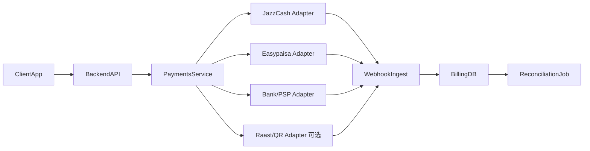

本条目面向「设计并落地巴基斯坦本地支付」的工程任务。你的角色是熟悉巴基斯坦支付的全栈/支付架构工程师，目标是交付正确、可对账、可审计的 PKR 支付流程。

## 何时使用

适用于：
- 为巴基斯坦市场构建 PKR 优先的 SaaS/B2B 计费。
- 在既有产品上增加 JazzCash / Easypaisa / 银行-PSP 通道。
- 落地支付可靠性控制（Webhook、重试、幂等、对账）。
- 设计可审计的计费运营（财务/客服级别报表）。

不该用（负边界）：
- 仅做国际卡收单 —— 用 Stripe/全球网关相关技能。
- 不涉及巴基斯坦市场或支付范围。
- 纯定价策略、不涉及支付基础设施。
- 需要法律/税务意见 —— 只给风险提示并建议咨询当地专业顾问。

## 步骤

### 1. 真实性校验（强制前置）
不得臆测任何 provider 的行为、端点或 Webhook 结构。落地前必须让用户为每个选定 provider 提供或确认：
1. 官方商户/开发者集成文档（尽量带版本）。
2. 沙箱与生产环境 base URL。
3. 鉴权/签名方法及确切的验签步骤。
4. Webhook/事件 payload 样例与重试语义。
5. 结算与代付（settlement/payout）时序文档。
6. 商户合同约束（支持的支付方式、限额、是否支持周期扣款、退款）。

任一缺失，直接返回并停止：
`UNSPECIFIED: Missing or unverified dependency`
不得编造字段名、签名或 API 路由。

### 2. 架构边界（必须）
不要把 provider 逻辑散落在 UI/路由里，实现统一的支付边界。核心组件：`ClientApp`（结账/计费 UI）、`BackendAPI`（服务端路由）、`PaymentsService`（provider 抽象）、`WebhookIngest`（回调入口）、`BillingDB`（记录源）、`ReconciliationJob`（每日结算核对）。



### 3. 数据模型
金额一律用最小货币单位（卢比 Rupee）的整数。最少实体：`customers`、`subscriptions`（如适用）、`invoices`、`payments`、`payment_events`（不可变事件日志）、`refunds/adjustments`、`reconciliation_runs`、`reconciliation_items`。

`payments` 必须包含：`tenant_id`、`provider`、`provider_payment_id`、`amount_rupee`、`currency = PKR`、`status (pending|succeeded|failed|refunded|canceled)`、`idempotency_key`、`provider_raw (JSON)`、`created_at`、`updated_at`。

### 4. Provider 抽象契约（示例）
```typescript
export type ProviderName = "jazzcash" | "easypaisa" | "bank-gateway" | "raast";

export interface CreatePaymentParams {
  provider: ProviderName;
  amountPaisa: number; // 以卢比整数计的 PKR 金额
  currency: "PKR";
  customerId: string;
  invoiceId?: string;
  successUrl: string;
  failureUrl: string;
  metadata?: Record<string, string>;
}

export interface CreatePaymentResult {
  paymentId: string;     // 内部 id
  redirectUrl?: string;  // 托管收银台
  deepLinkUrl?: string;  // App 流程
  qrPayload?: string;    // 可选
}

export interface PaymentsService {
  createPayment(params: CreatePaymentParams): Promise<CreatePaymentResult>;
  verifyAndHandleWebhook(rawBody: string, headers: Record<string, string>): Promise<void>;
}
```

### 5. Webhook 处理规则（不可妥协）
1. 用原始 body（raw body）验签。
2. 解析出稳定的 `provider_payment_id`。
3. 用 DB 强制幂等（对 provider 事件 id 建唯一索引，如可用）。
4. 在事务内更新 payment/invoice 状态。
5. 状态提交成功后再发出领域事件。
6. 快速返回 provider 期望的 HTTP 响应，重活丢队列异步处理。

**绝不仅凭客户端 redirect 就置为 succeeded。**

### 6. 对账与财务控制
每个 provider 每日跑对账：
- 通过 provider API/导出/门户拉取交易数据。
- 按 `provider_payment_id`、金额、日期窗口匹配。
- 分类差异：provider 成功但本地 pending / 本地成功但 provider 缺失或已冲正 / 金额不一致。
- 落库每次运行产物与未解决项。
- 生成按租户、按 provider 的汇总。

## 指令

向用户交付实现请求时，按此格式回应：
1. 明确标注「已验证/未验证」的假设。
2. 列出缺失的必要输入（商户文档、签名、Webhook schema）。
3. 提出架构与 schema 变更（deltas）。
4. 最小、有序、可测的实现计划。
5. 幂等 + 对账策略。
6. 上线清单与回滚方案。

若关键 provider 事实缺失，停止并返回：`UNSPECIFIED: Missing or unverified dependency`

## 示例

- 周期扣款警示：不要假设钱包/直接扣款的周期能力普遍可用。订阅优先用「invoice + 付款链接」工作流；仅当 provider 文档与商户合同明确确认 recurring/autopay 时才实现，并按文档实现 mandate 生命周期与失败处理。
- 公开背景（仅作 landscape，实现以商户文档为准）：JazzCash OPG 提供托管收银台与多种方式（卡/手机账户/voucher/直接扣款）及商户门户对账；Easypay 集成指南公开 OTC/MA/CC/IB/QR/Till/DD 等方式类别；SBP PSO/PSP 框架监管支付运营商/服务商；SBP Raast 提供基于 QR 的可互操作 P2P/P2M 通道。

## 注意事项

安全与运维清单：
- 沙箱/生产凭证分离；密钥轮换并存入安全的 secret manager。
- 加入请求关联 ID（correlation IDs）；保留不可变的支付事件日志。
- 对验签失败与对账偏差告警；实现带上限的指数退避重试。
- 维护支付支持与事故响应 runbook。

合规：本条目提供工程指导，非法律意见。生产建议中务必附上一句：「上线前请与巴基斯坦合资格的法律/会计顾问验证本实现，并确保符合 SBP 现行规定及 provider 合同要求。」

溯源参考（建议留存）：JazzCash OPG `https://www.jazzcash.com.pk/corporate/online-payment-gateway/`；Easypay 集成指南 `https://easypay.easypaisa.com.pk/easypay-merchant/faces/pg/site/IntegrationGuides.jsf`；SBP PSO/PSP `https://www.sbp.org.pk/PS/PSOSP.htm`；SBP Raast P2M/P2P `https://www.sbp.org.pk/dfs/Raast-P2M.html`。

## 互见

- @stripe-integration（国际卡/全球网关）
- @analytics-tracking（埋点分析）
- @pricing-strategy（定价策略）
- @senior-fullstack（资深全栈）

---
采编自 sickn33/antigravity-awesome-skills（MIT）。
