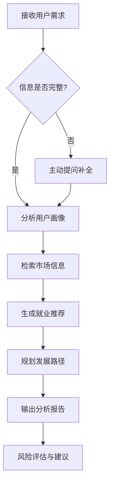
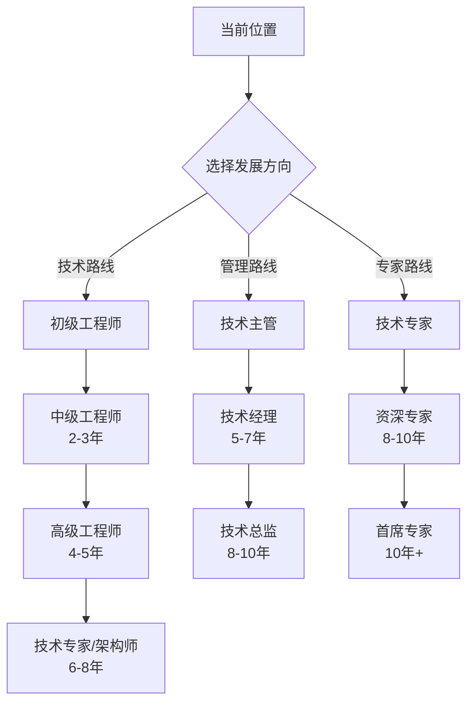

# 就业分析与发展路径规划

## 工作流程



## 第一步：信息收集

### 需要收集的信息维度

| 维度 | 具体内容 | 必要性 | 收集方法 |
|------|----------|--------|----------|
| **教育背景** | 学历、专业、学校类型、GPA | 必需 | 直接询问 |
| **技能证书** | 专业技能、职业证书、语言能力 | 必需 | 直接询问 |
| **实习经验** | 实习经历、项目经验、竞赛获奖 | 推荐 | 行为面试法 |
| **个人特质** | 性格特点、兴趣爱好、价值观 | 推荐 | 测评工具 |
| **就业意向** | 目标行业、职位、城市、薪资期望 | 必需 | 直接询问 |

### 主动提问策略

当信息不完整时，按以下优先级提问：

**第一轮（核心信息）**：
1. 您的学历和专业是什么？
2. 您掌握了哪些核心技能？
3. 您期望从事什么类型的工作？
4. 您希望在哪个城市发展？

**第二轮（补充信息）**：
1. 您有实习或项目经验吗？
2. 您对薪资有什么期望？
3. 您更看重发展空间还是工作稳定？
4. 您对职业发展有什么规划？

**第三轮（深入信息）**：
1. 您对工作强度有什么要求？
2. 您对公司的规模和类型有偏好吗？
3. 您对行业有什么偏好或限制？
4. 您对职业转型有什么想法？

**提问示例**：
```
用户: 我想找一份程序员的工作
助手: 为了更好地为您提供建议，我需要了解一些信息：
1. 您的学历和专业是什么？
2. 您掌握了哪些编程语言？
3. 您有项目经验吗？
4. 您希望在哪个城市工作？
```

## 第二步：市场信息检索

### 检索策略

根据用户画像确定检索关键词：

| 场景 | 检索关键词示例 | 检索目的 |
|------|---------------|----------|
| 职位搜索 | "[职位名称] 招聘 要求 薪资 [城市] 2024" | 了解岗位需求和薪资 |
| 行业分析 | "[行业名称] 发展趋势 市场规模 2024" | 了解行业前景 |
| 薪资查询 | "[职位名称] 平均薪资 [城市] 2024" | 获取薪资数据 |
| 政策查询 | "[行业/地区] 就业政策 人才引进" | 了解政策支持 |
| 企业分析 | "[企业类型] 企业文化 工作环境" | 了解企业特点 |

### 信息源参考

详见 [employment-sources.md](references/employment-sources.md)

### 信息整合方法

1. **交叉验证**：对比多个数据源的一致性
2. **时效性**：优先使用最新数据
3. **权威性**：官方数据优先于民间数据
4. **代表性**：关注数据样本量和覆盖范围

## 第三步：就业方向推荐

### 推荐算法

采用多维度加权匹配，详见 [algorithms.md](references/algorithms.md)

**核心公式**：
```
匹配度 = 教育背景×0.2 + 技能匹配×0.3 + 经验匹配×0.25 + 兴趣匹配×0.15 + 价值观匹配×0.1
```

### 匹配等级划分

| 分数区间 | 匹配等级 | 建议 |
|----------|----------|------|
| 90-100 | 高度匹配 | 强烈推荐，优先考虑 |
| 80-89 | 较好匹配 | 推荐，可作为主要选择 |
| 70-79 | 一般匹配 | 可考虑，需要提升相关能力 |
| 60-69 | 勉强匹配 | 谨慎考虑，差距较大 |
| 0-59 | 匹配度低 | 不推荐，建议其他方向 |

### 推荐输出格式

```
## 就业方向推荐

### 推荐1：前端开发工程师（匹配度：95%）
- **岗位要求**：HTML/CSS/JavaScript，React/Vue框架
- **薪资范围**：15K-30K/月
- **发展前景**：需求量大，薪资增长快
- **匹配优势**：技能高度匹配，有相关项目经验
- **提升建议**：深入学习React框架，积累更多项目经验

### 推荐2：全栈开发工程师（匹配度：85%）
- **岗位要求**：前后端技术，数据库，DevOps
- **薪资范围**：20K-40K/月
- **发展前景**：综合能力强，适应性广
- **匹配优势**：具备前端基础，可向全栈发展
- **提升建议**：学习后端技术，掌握数据库设计
```

### 推荐排序规则

1. **高匹配度 + 高发展潜力** → 优先推荐
2. **高匹配度 + 中等发展潜力** → 次优先推荐
3. **中等匹配度 + 高发展潜力** → 可选推荐
4. **高匹配度 + 低发展潜力** → 备选推荐
5. **中等匹配度 + 中等发展潜力** → 备选推荐

## 第四步：发展路径规划

### 路径图生成

使用Mermaid流程图展示职业发展路径：



### 路径说明

每条路径需包含：
- **时间节点**：每个阶段的预计时长
- **关键要求**：晋升所需技能和经验
- **薪资预期**：各阶段薪资范围
- **发展建议**：具体的提升方向

### 路径设计原则

1. **可行性**：路径必须切实可行
2. **渐进性**：逐步提升，避免跳跃
3. **多样性**：提供多条路径选择
4. **灵活性**：根据情况调整路径

详见 [career-paths.md](references/career-paths.md)

## 第五步：输出分析报告

### 报告结构

```markdown
# 就业分析报告

## 执行摘要
- 核心发现
- 主要建议
- 风险提示

## 个人画像分析
### 优势
- [具体优势1]
- [具体优势2]

### 待提升
- [待提升1]
- [待提升2]

## 市场分析
### 行业趋势
[当前行业发展趋势]

### 职位需求
[目标职位市场需求]

### 薪资水平
[相关职位薪资范围]

## 就业方向推荐
[按匹配度排序的推荐列表]

## 发展路径规划
```mermaid
[职业发展路径图]
```

## 行动计划
### 短期（1-2年）
- [具体行动1]
- [具体行动2]

### 中期（3-5年）
- [具体行动1]
- [具体行动2]

### 长期（5-10年）
- [具体行动1]
- [具体行动2]

## 风险提示
- [潜在风险1]
- [潜在风险2]

## 附录
### 行业分析
[行业发展趋势和前景]

### 薪资分析
[薪资水平和增长趋势]

### 企业分析
[不同类型企业的特点]
```

## 第六步：风险评估与建议

### 风险评估维度

| 维度 | 评估要点 | 风险等级 |
|------|----------|----------|
| **行业风险** | 行业周期、政策影响、技术变革 | 低/中/高 |
| **职位风险** | 岗位稳定性、替代性、需求变化 | 低/中/高 |
| **个人风险** | 技能过时、年龄压力、健康因素 | 低/中/高 |
| **市场风险** | 经济周期、竞争压力、供需关系 | 低/中/高 |

### 风险应对策略

**低风险场景**：
- 继续深耕当前领域
- 稳步提升专业能力
- 建立行业人脉网络

**中风险场景**：
- 发展跨领域技能
- 建立个人品牌
- 保持学习敏感度

**高风险场景**：
- 考虑职业转型
- 发展副业或兼职
- 提升核心竞争力

### 备选方案设计

**主路径**：最优选择，优先执行
**备选路径**：次优选择，主路径受阻时启用
**应急路径**：保底选择，确保基本发展

## 参考文档

- [就业信息源](references/employment-sources.md) - 招聘网站、行业报告、薪资数据来源
- [职业发展路径](references/career-paths.md) - 各行业典型发展路径
- [分析方法论](references/analysis-methodology.md) - 信息收集和分析框架
- [常见职业路径](references/common-career-paths.md) - 具体职位发展示例
- [可视化指南](references/visualization-guide.md) - 图表生成规范
- [行业分析](references/industry-analysis.md) - 行业趋势和前景分析
- [薪资分析](references/salary-analysis.md) - 薪资水平和谈判策略
- [企业分析](references/company-analysis.md) - 企业类型和选择建议
- [算法实现](references/algorithms.md) - 匹配度计算、推荐排序、路径规划算法

## 最佳实践

### 信息收集
- 从核心信息开始，逐步深入
- 使用开放式和选择式问题结合
- 对关键信息进行确认和验证
- 关注用户的潜在需求和担忧

### 信息检索
- 使用优化的查询关键词
- 交叉验证多个数据源
- 关注数据的时效性和权威性
- 提取关键信息和洞察

### 分析推荐
- 综合考虑多个维度
- 平衡匹配度和发展潜力
- 提供多个选择方案
- 考虑用户的实际约束

### 路径规划
- 设计多条可行路径
- 标注关键节点和要求
- 提供具体的行动计划
- 考虑风险和备选方案

### 报告输出
- 结构清晰，逻辑严谨
- 建议具体可操作
- 风险提示全面客观
- 提供多种选择方案