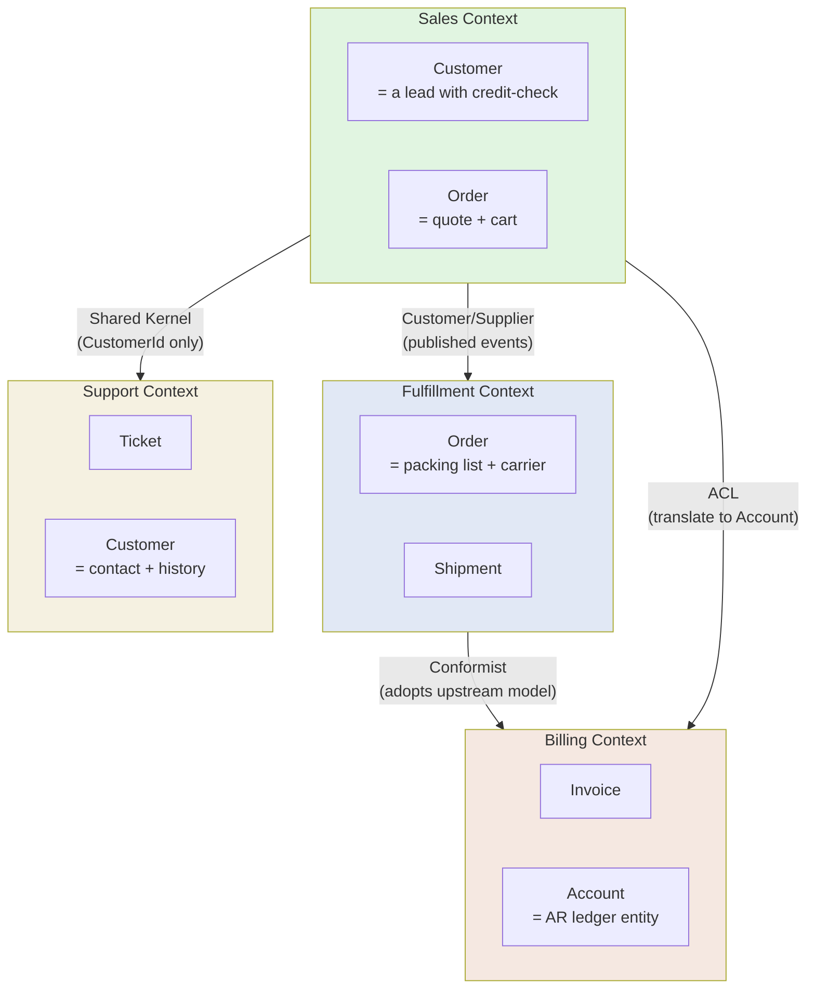
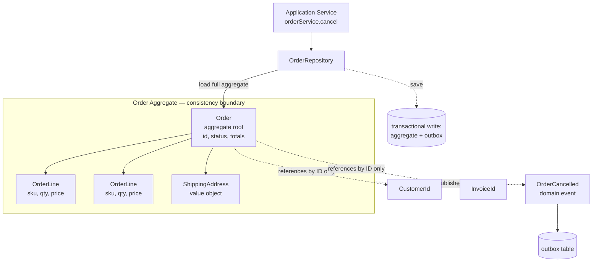
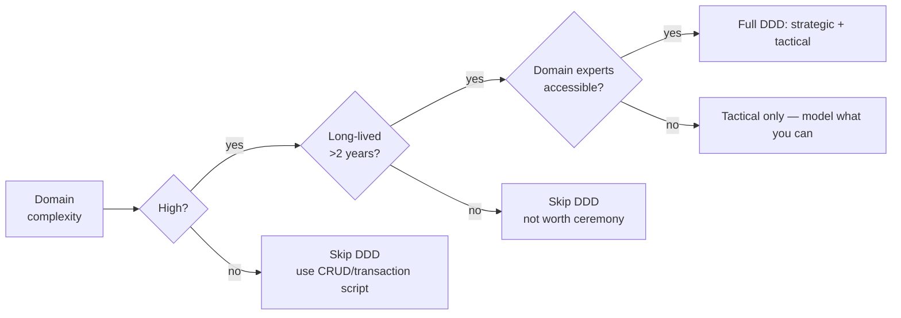

# Domain-Driven Design (DDD)

## Why This Exists

**Problem.** Software complexity rarely comes from algorithms. It comes from **business rules nobody fully understands**, expressed in **language nobody fully shares**. Engineers model "the data," wire up CRUD, and the messy semantics — when is an order "shipped" vs "fulfilled"? does a "customer" include a prospect? — leak into ad-hoc `if`s spread across services. Six months in, every change requires archaeology, and the same bug fix must be applied in five places.

**Key insight (Eric Evans, 2003).** Most of the value of OO/modeling is wasted unless the **model in code matches the model in the domain experts' heads**, and that match is enforced by a **shared ubiquitous language** spoken by everyone — analyst, PM, engineer, support — for that part of the system. When two parts of the business mean different things by the same word, they are **different bounded contexts**, and forcing one model on both will silently corrupt your data.

DDD is two halves welded together:

- **Strategic DDD** — how to carve a system into **bounded contexts**, draw the **context map** between them, and protect each context's model from outside corruption. This is mostly an organizational/architectural question.
- **Tactical DDD** — within one bounded context, how to express the model: **entities, value objects, aggregates, repositories, domain services, domain events**. This is mostly a code-design question.

You can do strategic DDD without tactical DDD (microservice carving). You can do tactical DDD without strategic DDD (rich domain model in a monolith). The full payoff comes from doing both.

**Reach for this when:**

- The domain has **non-trivial invariants** that span multiple fields/objects (financial reconciliation, insurance underwriting, healthcare scheduling, logistics, regulated workflows).
- Business experts and engineers **already disagree on terminology** in standups.
- You're decomposing a monolith and need a **principled way to draw service boundaries** instead of "by table" or "by team."
- You've watched the same business rule **drift across copies** in different endpoints/services.
- Long-lived product (>2 years) where the cost of getting boundaries wrong compounds.

**Don't reach for this when:**

- It's **CRUD over a known schema** with no business rules beyond validation. DDD will turn 200 lines into 2,000.
- **Data pipelines / ETL / analytics** where the "domain" is "move bytes correctly." Use functional pipeline patterns.
- **Prototypes / spikes** — you don't yet know what the bounded contexts are. Premature DDD freezes the wrong model.
- Small team (<5 engineers) on a small product (<50k LOC) — the ceremony costs more than the clarity buys.
- The team **doesn't have access to domain experts**. DDD without an expert is just guessing in fancy clothes.

## Diagrams

### Strategic: bounded contexts and the context map



Notice: **"Customer" exists in three contexts and means three different things.** That's not a bug; that's the point. Forcing one canonical `Customer` table across all four would couple unrelated change drivers.

### Tactical: aggregate as a consistency boundary



**Rules:** one transaction = one aggregate. Cross-aggregate consistency is **eventual** (via events). Other aggregates are referenced **by ID, not by object reference**, or you'll accidentally load half the database.

## Strategic DDD

### 1. Ubiquitous Language

A glossary that **the code uses verbatim**. If the underwriter says "binding," the class is `Binding`, not `PolicyAgreement`. If two stakeholders use different words for the same concept, you facilitate a meeting and pick one — that act of disambiguation is half the value of DDD.

Anti-pattern: a `domain glossary.md` written once, never updated, ignored by the code. Test: open a random PR diff, read class/method names aloud — would a domain expert in that area understand them without translation?

### 2. Bounded Context

A **boundary inside which the ubiquitous language is consistent and the model is internally coherent**. Outside it, the same word can mean something else. Boundaries are usually drawn around:

- A **subdomain** of the business (sales vs fulfillment vs billing).
- A **team's area of ownership** (Conway's Law — a context that crosses team boundaries will fracture).
- A **lifecycle** (pre-sale customer vs post-sale customer have different invariants).

Practical heuristic: if you find yourself writing `if context == 'sales': ... else: ...` to interpret the same field, you've merged two bounded contexts that should be split.

### 3. Context Map — the relationships between contexts

Eight named relationship patterns from Evans/Vernon. The ones that matter most:

| Pattern | When | Cost |
|---|---|---|
| **Shared Kernel** | Two teams share a small core model (e.g. `CustomerId`, `Money`). | Every change requires both teams' agreement. Keep it tiny. |
| **Customer/Supplier** | Upstream publishes; downstream consumes; downstream's needs influence upstream's roadmap. | Upstream must take downstream's requirements seriously. |
| **Conformist** | Downstream adopts upstream's model wholesale (often because upstream is a vendor or central team). | Downstream is at upstream's mercy when upstream changes. |
| **Anti-Corruption Layer (ACL)** | Downstream translates upstream's model into its own. Use when integrating with a legacy system or vendor whose model you don't want polluting yours. | Extra translation code, extra latency. **Worth it almost always at integration boundaries.** |
| **Open Host Service** | Upstream publishes a stable, well-documented protocol for many consumers. | Upstream commits to backward compatibility. |
| **Published Language** | A formal schema (Avro, Protobuf, JSON schema) used between contexts. | Schema evolution discipline required. |
| **Separate Ways** | Two contexts have nothing meaningful to share — don't try. | None — this is the *correct* answer surprisingly often. |
| **Big Ball of Mud** | The legacy system you're working *around*. Acknowledge it, wall it off with an ACL. | Don't pretend it's not there. |

The single most valuable pattern in practice: **Anti-Corruption Layer**. Whenever you integrate with a system whose model you can't change (vendor API, legacy service, third-party SaaS), put a translation layer between it and your domain. Otherwise its concepts metastasize through your code.

```python
# Anti-Corruption Layer example: integrating a legacy CRM into our Sales context.
# Their `Account` is our `Customer`, their statuses are different, their IDs are strings.

# --- legacy CRM client (their model, untouched) ---
class LegacyCrmAccount:
    def __init__(self, raw: dict):
        self.account_id: str = raw["acc_id"]        # "ACC-00123"
        self.status: str = raw["stat"]               # "A", "S", "C", "P"
        self.full_name: str = raw["nm"]
        self.credit_limit_cents: int = raw["clim"]

# --- our domain (Sales context) ---
@dataclass(frozen=True)
class CustomerId:
    value: UUID

class CustomerStatus(Enum):
    ACTIVE = "active"
    SUSPENDED = "suspended"
    CHURNED = "churned"
    PROSPECT = "prospect"

@dataclass
class Customer:
    id: CustomerId
    name: str
    status: CustomerStatus
    credit_limit: Money

# --- the ACL: the ONLY place that knows about both models ---
class CrmCustomerTranslator:
    _STATUS_MAP = {
        "A": CustomerStatus.ACTIVE,
        "S": CustomerStatus.SUSPENDED,
        "C": CustomerStatus.CHURNED,
        "P": CustomerStatus.PROSPECT,
    }

    def __init__(self, id_resolver: "CrmIdResolver"):
        self._id_resolver = id_resolver

    def to_domain(self, legacy: LegacyCrmAccount) -> Customer:
        status = self._STATUS_MAP.get(legacy.status)
        if status is None:
            # Don't silently default — surface the unknown status.
            raise UnknownLegacyStatus(legacy.status)
        return Customer(
            id=self._id_resolver.resolve(legacy.account_id),
            name=legacy.full_name,
            status=status,
            credit_limit=Money(cents=legacy.credit_limit_cents, currency="USD"),
        )
```

Without an ACL, `legacy.stat == "A"` checks would leak into your domain logic, and the day they add status `"H"` (hold), you have to grep your entire codebase to find every interpretation site.

## Tactical DDD

Within one bounded context, the building blocks. **These are not mandatory** — pick the ones the model needs.

### Value Objects

**Immutable, equality by value, no identity.** `Money(100, USD)` is the same as any other `Money(100, USD)`. Replace all your "primitive obsession" (`float price`, `str email`, `int days_until_expiry`) with value objects. This is the single highest-leverage move in tactical DDD.

```python
@dataclass(frozen=True)
class Money:
    """Value object. Currency arithmetic is wrong by default in floats."""
    cents: int
    currency: str

    def __post_init__(self):
        if self.cents < 0:
            raise ValueError("Money cannot be negative; use a separate Refund type.")
        if self.currency not in {"USD", "EUR", "GBP", "JPY"}:
            raise ValueError(f"Unsupported currency: {self.currency}")

    def __add__(self, other: "Money") -> "Money":
        if self.currency != other.currency:
            # Refuse silent currency mixing — this has caused real production
            # incidents in payments systems.
            raise CurrencyMismatch(self.currency, other.currency)
        return Money(cents=self.cents + other.cents, currency=self.currency)

    def times(self, n: int) -> "Money":
        return Money(cents=self.cents * n, currency=self.currency)


@dataclass(frozen=True)
class Email:
    value: str
    def __post_init__(self):
        if "@" not in self.value or len(self.value) > 254:
            raise InvalidEmail(self.value)
```

Now `def charge(amount: Money)` is **impossible to call wrong**. You can't pass dollars to a method expecting euros without an explicit conversion, because the type system says no.

### Entities

**Mutable, equality by ID.** Two `Customer` objects with the same ID are the same entity, even if their other fields differ (one is stale). Identity persists across changes.

```python
class Customer:
    def __init__(self, id: CustomerId, email: Email, status: CustomerStatus):
        self._id = id
        self._email = email
        self._status = status

    @property
    def id(self) -> CustomerId:
        return self._id

    def __eq__(self, other):
        return isinstance(other, Customer) and self._id == other._id

    def __hash__(self):
        return hash(self._id)

    def change_email(self, new_email: Email) -> None:
        # Behavior lives on the entity. NOT in a CustomerService.update_email().
        if self._status == CustomerStatus.CHURNED:
            raise CannotModifyChurnedCustomer(self._id)
        self._email = new_email
```

### Aggregates — the most important tactical pattern

An **aggregate** is a cluster of entities and value objects with one **aggregate root**. Three rules:

1. **All access from outside goes through the root.** External code holds a reference to `Order`, never directly to an `OrderLine`.
2. **The root enforces all invariants** spanning the cluster. (E.g. "total = sum of lines"; "no more than 100 lines.")
3. **One transaction = one aggregate.** When you need to change two aggregates atomically, you almost certainly drew the boundary wrong, OR you should accept eventual consistency between them.

The aggregate is your **consistency boundary** and your **concurrency boundary**. It's the unit you load, the unit you save, the unit you lock.

```python
class Order:
    """Aggregate root. The ONLY way to mutate OrderLines is through Order's methods."""

    MAX_LINES = 100

    def __init__(
        self,
        id: OrderId,
        customer_id: CustomerId,  # reference by ID, NOT by Customer object
        currency: str,
    ):
        self._id = id
        self._customer_id = customer_id
        self._currency = currency
        self._lines: list[OrderLine] = []
        self._status = OrderStatus.DRAFT
        self._events: list[DomainEvent] = []

    @property
    def total(self) -> Money:
        # Invariant: total is always derivable from lines. Never stored.
        if not self._lines:
            return Money(0, self._currency)
        return reduce(lambda a, b: a + b, (line.subtotal for line in self._lines))

    def add_line(self, sku: Sku, qty: int, unit_price: Money) -> None:
        # Root enforces invariants:
        if self._status != OrderStatus.DRAFT:
            raise OrderNotEditable(self._id, self._status)
        if unit_price.currency != self._currency:
            raise CurrencyMismatch(self._currency, unit_price.currency)
        if len(self._lines) >= self.MAX_LINES:
            raise OrderTooLarge(self._id)
        if qty <= 0:
            raise InvalidQuantity(qty)
        self._lines.append(OrderLine(sku=sku, qty=qty, unit_price=unit_price))

    def submit(self) -> None:
        if self._status != OrderStatus.DRAFT:
            raise IllegalStateTransition(self._status, OrderStatus.SUBMITTED)
        if not self._lines:
            raise EmptyOrderCannotBeSubmitted(self._id)
        self._status = OrderStatus.SUBMITTED
        self._events.append(OrderSubmitted(
            order_id=self._id,
            customer_id=self._customer_id,
            total=self.total,
            occurred_at=utcnow(),
        ))

    def cancel(self, reason: str) -> None:
        if self._status in (OrderStatus.SHIPPED, OrderStatus.CANCELLED):
            raise IllegalStateTransition(self._status, OrderStatus.CANCELLED)
        self._status = OrderStatus.CANCELLED
        self._events.append(OrderCancelled(
            order_id=self._id, reason=reason, occurred_at=utcnow(),
        ))

    def pull_events(self) -> list[DomainEvent]:
        events, self._events = self._events, []
        return events


@dataclass(frozen=True)
class OrderLine:
    """Inside the aggregate. Value-object-ish — no identity *outside* the order."""
    sku: Sku
    qty: int
    unit_price: Money

    @property
    def subtotal(self) -> Money:
        return self.unit_price.times(self.qty)
```

**Critical anti-pattern:** giving `OrderLine` a public `quantity` setter. Now `order.lines[3].quantity = 999` bypasses the root's invariants. The aggregate is no longer enforcing anything.

### Aggregate sizing — the recurring trap

Vernon (2013) wrote an entire essay on this. The mistake everyone makes the first time: making aggregates too big. ("Customer contains all their orders, all their addresses, all their support tickets...") Then:

- Every customer save becomes a 50-table transaction.
- Concurrent updates to *unrelated* parts of "Customer" conflict on the optimistic-lock version column.
- You can't shard.

**Heuristic: prefer small aggregates.** If two pieces of data don't have a *true* invariant linking them ("we must always change them together or one of them is wrong"), they belong to **separate aggregates**, referenced by ID, with eventual consistency between them.

Test: "If aggregate A is updated and aggregate B is 30 seconds stale, is the system in an *invalid* state, or just a *temporarily-inconsistent-but-valid* state?" If the latter, they are correctly separate.

### Repositories

A **collection-like interface** for one aggregate type. Hides persistence. Returns whole aggregates, never partial DTOs.

```python
class OrderRepository(Protocol):
    def get(self, id: OrderId) -> Order: ...
    def save(self, order: Order) -> None: ...
    # Note: no `find_by_status_and_customer_and_...`. That's a query concern,
    # not a repository concern. Use a separate read model (CQRS) for that.


class SqlOrderRepository:
    def __init__(self, session: Session, event_publisher: OutboxPublisher):
        self._session = session
        self._publisher = event_publisher

    def get(self, id: OrderId) -> Order:
        row = self._session.query(OrderRow).filter_by(id=id.value).one()
        lines = self._session.query(OrderLineRow).filter_by(order_id=id.value).all()
        return _hydrate_order(row, lines)

    def save(self, order: Order) -> None:
        # Upsert root + lines. Then drain events into the outbox in the SAME tx.
        self._upsert(order)
        for event in order.pull_events():
            self._publisher.enqueue(event)  # writes to outbox table
        # Caller's UoW commits the transaction.
```

**One repository per aggregate root.** Not one per table. Not one per query.

### Domain Services

When a behavior **doesn't belong to any single entity or aggregate** — it operates on multiple — put it in a **domain service**. (Don't reach for this until you've tried hard to put the behavior on an entity. "Service-itis" is the #1 way DDD codebases regress to anemic models.)

```python
class FundsTransferService:
    """Operates across two Account aggregates. Cannot live on either alone."""

    def transfer(
        self,
        source: Account,
        destination: Account,
        amount: Money,
    ) -> TransferReceipt:
        # Two aggregates → two transactions, OR a saga.
        # If you find yourself wanting one tx across both, your aggregate
        # boundary is wrong (or you actually want one Account aggregate
        # with sub-balances, which is a totally different model).
        source.withdraw(amount)
        destination.deposit(amount)
        return TransferReceipt(...)
```

### Application Services

**Thin orchestration.** No business logic. Loads aggregates, calls methods on them, saves. This is the layer that talks to controllers/handlers above and repositories/UoW below.

```python
class CancelOrderUseCase:
    def __init__(self, repo: OrderRepository, uow: UnitOfWork):
        self._repo = repo
        self._uow = uow

    def execute(self, cmd: CancelOrderCommand) -> None:
        with self._uow:
            order = self._repo.get(cmd.order_id)
            order.cancel(reason=cmd.reason)  # all the rules live HERE
            self._repo.save(order)
            self._uow.commit()
```

If your application service has an `if`, it's probably hiding a domain rule that wants to live on the aggregate.

### Domain Events

A fact that happened in the past, named in the ubiquitous language. `OrderSubmitted`, `PaymentCaptured`, `PolicyBound`. Not `OrderInsertRequested` (mechanical) or `EmailShouldBeSent` (a command, not an event).

```python
@dataclass(frozen=True)
class OrderSubmitted:
    order_id: OrderId
    customer_id: CustomerId
    total: Money
    occurred_at: datetime
```

Use the **transactional outbox pattern** to publish them: write the event row to a DB table inside the same transaction as the aggregate change, then a separate process forwards from the outbox to the message broker. This is the only sane way to get at-least-once delivery without distributed transactions. See `../../data-systems/outbox/`.

## When DDD Pays Back vs When It's Overkill

DDD has real cost: more files, more layers, more vocabulary, slower onboarding. The payback comes from:

1. **Long-term maintainability** in complex domains — invariants enforced in one place, not 17.
2. **Better service decomposition** — bounded contexts give you principled cut lines.
3. **Better communication** — ubiquitous language reduces translation defects.



**Lean toward "transaction script" or "active record" when:** the domain *is* the database, business rules are mostly "is this field valid," and the team is small.

**Lean toward full DDD when:** the domain has multi-step state machines, the same entity behaves differently in different lifecycle stages, or you've already watched a CRUD codebase rot.

## Trade-offs

| Benefit | Cost |
|---|---|
| Code matches domain — fewer translation defects, easier onboarding for domain-literate folks | Steeper learning curve for engineers; ceremony slows simple CRUD |
| Aggregates give clear consistency/concurrency boundaries | "Eventual consistency between aggregates" is a real conceptual hurdle for teams used to one-big-transaction |
| Bounded contexts give principled service decomposition | Forces you to confront ambiguity early; political cost of "your team and our team mean different things by 'customer'" |
| Ubiquitous language reduces meeting friction | Requires sustained access to domain experts — without them, DDD is theater |
| Value objects + invariants in constructors → impossible illegal states | More classes, more files; primitive obsession is *fast* to write |
| Domain events enable evolution (new consumers without changing producer) | Async processing means harder debugging, ordering guarantees, and idempotency design |
| Anti-Corruption Layer protects model from vendor/legacy churn | Extra translation code at every integration; an additional hop to maintain |
| Decouples persistence (repositories) from domain | More layers to navigate; cargo-culted hexagonal architecture often adds layers without benefit |

## Common Pitfalls

- **Anemic Domain Model.** Entities are bags of getters/setters; logic lives in `OrderService`, `OrderManager`, `OrderHelper`. You've kept all the cost of DDD ceremony with none of the benefit. Fix: every time you write `service.doSomethingTo(entity)`, ask "why isn't this `entity.doSomething()`?"
- **Aggregate too big.** "Customer" contains every order they ever placed. Reads are slow, writes contend, you can't scale. Fix: split. Reference by ID. Accept eventual consistency.
- **Aggregate spanning service boundaries.** Two aggregates, two services, but you want one transaction across them. You don't get one. Either re-merge them, or design a saga (and accept the failure modes — see `../../architecture-patterns/saga/`).
- **Repository as DAO.** `repo.findByStatusAndDateRangeAndCustomerType(...)` with 12 finder methods. That's not a repository, that's a query layer. Move queries to a read model (CQRS).
- **One canonical model across all contexts.** "Let's have a single `Customer` microservice everyone calls." You've reinvented the shared database, distributed. Every change to Customer requires every team's review. Fix: each context has its own `Customer` (or whatever name fits *that* context); IDs are the only shared kernel.
- **Ubiquitous language drift.** Glossary written once, code uses different terms. Ubiquitous language must be **continuously enforced in PRs and refactors** or it dies.
- **Skipping the ACL at integration boundaries.** Vendor's `OrderStatus` strings show up in your aggregate. They change `"A"` to `"ACTIVE"` and you have a 3-day fire drill. Fix: ACL, every time, no exceptions.
- **Event Sourcing assumed.** ES is independent of DDD. ES is great for audit-heavy domains and a nightmare for everything else. Don't assume "DDD = ES."
- **Hexagonal-architecture cargo-culting.** Three layers of mappers between domain and DB for a 200-LOC service. The pattern has a cost; spend it where the domain repays it.
- **DDD without domain experts.** You're guessing. The model will be wrong, and worse, you won't know it's wrong. Either get expert access or don't pretend you're doing DDD.

## Decision Table

| Situation | Approach | Why |
|---|---|---|
| CRUD over known schema, no rules | **Transaction script / Active Record** | DDD ceremony costs more than it saves |
| Complex multi-step business workflow, long-lived | **Full DDD (strategic + tactical)** | Invariant enforcement + boundary clarity pays back |
| Decomposing a monolith into services | **Strategic DDD first** (bounded contexts, context map) | Don't cut by table — cut by context |
| Integrating with vendor API or legacy system | **Anti-Corruption Layer** (always) | Protects domain from upstream churn |
| Two parts of business use same word differently | **Two bounded contexts** | One model can't serve both without `if context == ...` everywhere |
| Need atomic update across two "aggregates" | **Re-examine boundary** — likely they should be one aggregate, OR you need a saga | If you truly need cross-aggregate atomicity, you drew it wrong |
| High read volume, complex queries against domain | **CQRS** (separate read model) | Repositories are bad query layers |
| Audit-heavy domain (financial, regulated) | **Consider Event Sourcing** + DDD | Events become the source of truth |
| Reporting/analytics over domain | **Don't query the aggregate store** — feed events into a warehouse | Aggregates are write-optimized |
| Team has no domain expert access | **Tactical DDD only** (value objects, small aggregates) | Strategic DDD without experts is guessing |
| Prototype / spike | **Don't do DDD yet** | Premature boundaries are worse than no boundaries |
| Microservice carving by team / Conway's Law | **Strategic DDD aligns with team boundaries** | Bounded context per team is the right default |

## References

- Eric Evans — *Domain-Driven Design: Tackling Complexity in the Heart of Software* (Addison-Wesley, 2003). The original "Blue Book." Chapters on bounded contexts (ch. 14), context maps (ch. 14), aggregates (ch. 6), ubiquitous language (ch. 2) are essential.
- Eric Evans — *Domain-Driven Design Reference (2015 free PDF)* — https://www.domainlanguage.com/ddd/reference/ — concise restatement of all patterns.
- Vaughn Vernon — *Implementing Domain-Driven Design* (Addison-Wesley, 2013). The "Red Book." More practical/code-focused than Evans. Chapter 10 on aggregates is the definitive treatment of aggregate sizing.
- Vaughn Vernon — *Effective Aggregate Design* (3-part essay) — https://www.dddcommunity.org/library/vernon_2011/ — read this before writing your first aggregate.
- Vaughn Vernon — *Domain-Driven Design Distilled* (Addison-Wesley, 2016). The 150-page introduction; start here if you haven't read Evans/Vernon.
- Martin Fowler — *Bounded Context* — https://martinfowler.com/bliki/BoundedContext.html
- Martin Fowler — *Anemic Domain Model* — https://martinfowler.com/bliki/AnemicDomainModel.html
- Martin Fowler — *Aggregate* — https://martinfowler.com/bliki/DDD_Aggregate.html
- Martin Fowler — *Patterns of Enterprise Application Architecture* (Addison-Wesley, 2002). Chapters on Domain Model, Transaction Script, Repository, Unit of Work — the tactical vocabulary DDD builds on.
- Pat Helland — *Life beyond Distributed Transactions: an Apostate's Opinion* (CIDR 2007) — https://www.ics.uci.edu/~cs223/papers/cidr07p15.pdf — the canonical argument for "one entity = one transaction" that underpins aggregate design.
- Pat Helland — *Data on the Outside vs. Data on the Inside* (CIDR 2005) — https://www.cidrdb.org/cidr2005/papers/P12.pdf — why context boundaries matter for data semantics.
- Greg Young — *CQRS Documents* — https://cqrs.files.wordpress.com/2010/11/cqrs_documents.pdf — origin of CQRS, frequently paired with DDD.
- Kleppmann — *Designing Data-Intensive Applications* (O'Reilly 2017). Ch. 7 on transactions and ch. 9 on consistency directly inform aggregate design and cross-context consistency.
- Domain-Driven Design Community — pattern library — https://www.dddcommunity.org/learning-ddd/what_is_ddd/
- Microsoft — *DDD-Oriented Microservice Architecture* — https://learn.microsoft.com/en-us/dotnet/architecture/microservices/microservice-ddd-cqrs-patterns/

## See Also

- `../../architecture-patterns/event-sourcing/` — Event Sourcing; orthogonal to DDD but frequently combined.
- `../../architecture-patterns/hexagonal/` — Ports and Adapters; the architectural style that hosts a DDD domain model.
- `../../architecture-patterns/saga/` — for cross-aggregate, cross-context workflows.
- `../../data-systems/outbox/` — for reliable domain event publication.
- `../../data-systems/consistency-models/` — the consistency model between aggregates and bounded contexts.
- `../value-objects/` — deep dive on value objects and primitive obsession.
- `../tdd-bdd/` — how to test aggregates and domain services without persistence.
