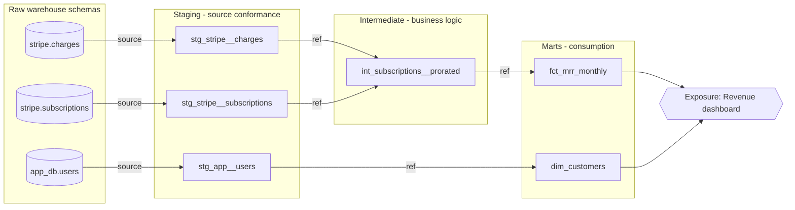

# Analytics Engineering

Analytics engineering is the discipline of treating data transformation as software: version-controlled SQL, layered models with explicit dependencies, tests that run before deployment, documentation generated from code, and CI that blocks bad changes. The core artifact is a dbt project, and the core mindset shift is that a dbt project *is* a codebase — it deserves the same review culture, naming discipline, and release process as any service in production.

Why it matters: without this discipline, transformation logic scatters across BI tools, saved queries, and stored procedures. Every dashboard computes "revenue" slightly differently, nobody can safely change anything, and data quality failures are discovered by the CFO instead of by a test. A layered, tested dbt project gives you one definition per metric, a dependency graph you can reason about, and a diff-able, reviewable change history.

**When NOT to use this:**

- **You have one analyst and three tables.** A dbt project with staging/intermediate/marts layering for five models is ceremony. Start with a flat `models/` folder and a handful of tests; adopt layering when the project passes ~15 models or a second contributor arrives.
- **The workload is operational, not analytical.** Sub-second lookups, application state, or reverse-ETL write-backs belong in application services and their databases, not in batch-transformed marts.
- **You need true streaming latency.** dbt is batch/micro-batch. If the requirement is seconds-fresh data, you need a streaming pipeline (Flink, Materialize, warehouse streaming tables); dbt can model *on top of* the landed stream, not replace it.
- **The source data is not yet reliably landed.** Fix extraction and loading first (Fivetran, Airbyte, custom EL). Modeling on top of a flaky loader produces well-tested wrong answers.

## Decision Framework

Four choices shape every dbt project. Make them explicitly and write them down in the repo.

| Decision | Options | Choose... | Trade-off you accept |
|---|---|---|---|
| **Materialization per layer** | view / table / incremental / ephemeral | Staging: `view`. Intermediate: `ephemeral` (or `table` if reused by 2+ marts or slow). Marts: `table`; `incremental` only above ~100M rows or >10 min build | Views are always fresh but push compute to query time; incremental is cheap to run but adds an entire class of failure modes (see below) |
| **Test strategy** | data tests only / unit tests only / both | Both: data tests on every primary key and mart, unit tests on every model with non-trivial logic (dbt 1.8+) | Unit tests need maintained fixtures; data tests need production data and catch problems *after* they land |
| **Incremental strategy** | `merge` / `delete+insert` / `insert_overwrite` / `microbatch` (dbt 1.9+) | `merge` when rows update in place and you have a reliable unique key; `insert_overwrite`/`microbatch` for append-only event data partitioned by time | `merge` handles updates but needs a truly unique key; partition-replacement strategies are idempotent per partition but can't update rows outside the replaced window |
| **CI scope** | full build every PR / slim CI (state comparison) / SQL-only linting | Slim CI: `state:modified+` with `--defer` against production artifacts; nightly full build as backstop | Slim CI can miss breakage in unmodified downstream logic that depends on *data* shape; the nightly full build is the safety net, not optional |

## Project Layout and Naming

```
dbt_project/
├── dbt_project.yml
├── packages.yml              # dbt_utils, dbt_expectations
├── models/
│   ├── staging/              # 1:1 with source tables; the ONLY place source() appears
│   │   └── stripe/
│   │       ├── _stripe__sources.yml
│   │       ├── _stripe__models.yml
│   │       ├── stg_stripe__charges.sql
│   │       └── stg_stripe__subscriptions.sql
│   ├── intermediate/         # business logic building blocks, not user-facing
│   │   └── finance/
│   │       └── int_subscriptions__prorated.sql
│   └── marts/                # what humans and BI tools query
│       └── finance/
│           ├── _finance__models.yml
│           ├── fct_subscription_events.sql
│           ├── fct_mrr_monthly.sql
│           └── dim_customers.sql
├── macros/
├── seeds/                    # small static mappings only (country codes, plan tiers)
├── snapshots/                # SCD2 capture of mutable sources
└── tests/                    # singular (bespoke) data tests
```

**Naming conventions (non-negotiable within a project):**

| Prefix | Layer | Pattern | Example |
|---|---|---|---|
| `stg_` | Staging | `stg_<source>__<entity>` | `stg_stripe__charges` |
| `int_` | Intermediate | `int_<entity>__<verb>` | `int_subscriptions__prorated` |
| `fct_` | Mart (events/measures) | `fct_<grain>` | `fct_subscription_events` |
| `dim_` | Mart (entities) | `dim_<entity>` | `dim_customers` |

**ref() discipline** — the rules that keep the DAG sane:

1. `source()` appears only in staging models. Everything else uses `ref()`.
2. No model ever references a raw table by name. If it isn't `ref()` or `source()`, it doesn't exist.
3. Marts never `ref()` staging directly when intermediate logic exists — skipping layers hides business logic in the mart.
4. No `ref()` cycles, no `ref()` from staging to marts (upward references). The DAG flows one direction.
5. Cross-mart references are allowed (`dim_customers` from `fct_mrr_monthly`) but a mart is never built *from* another mart's aggregation — go back to intermediate.



## Process

1. **Inventory sources.** List every raw schema/table feeding analytics. Declare them in `_<source>__sources.yml` with `loaded_at_field` and freshness thresholds before writing any model.
2. **Build staging.** One model per source table: rename to project conventions (snake_case, `_id` suffixes, `_at` timestamps), cast types, no joins, no filters except deduplication. Materialize as views.
3. **Define mart grain first.** For each deliverable, write one sentence: "one row per ___ per ___." If you can't write it, you aren't ready to write SQL.
4. **Write intermediate models** for any logic used twice or any join/pivot that would make a mart unreadable. Name them after what they *do* (`int_orders__pivoted_to_customer`).
5. **Write marts** that read like the business talks: `fct_` for measurable events at a declared grain, `dim_` for entities with attributes.
6. **Test as you go.** Every model gets `unique` + `not_null` on its primary key the moment it's created — not in a later "testing sprint." Add unit tests for models with case logic, window functions, or date math.
7. **Document at PR time.** `description` on every model and every column in the mart layer; staging columns can inherit meaning from the model description. Wire dashboards in as `exposures`.
8. **Set up slim CI** (state comparison against production artifacts) so PRs build only what changed, plus a scheduled full `dbt build` and `dbt source freshness` in production.
9. **Review like software.** Every change is a PR; reviewers check grain, naming, test coverage, and query plans — not just "does it run."
10. **Maintain.** Monthly: prune unused models (`dbt ls` + warehouse query logs), full-refresh incremental models whose logic changed, review test failures for tests that only ever warn.

## Testing Strategy: Unit Tests vs Data Tests

Two different tools for two different questions. **Unit tests** (dbt 1.8+) verify *your SQL logic* against fixed inputs at compile/CI time — no production data needed. **Data tests** verify *the data itself* after models build. Teams that only have data tests discover logic bugs in production; teams that only have unit tests never notice the loader shipped duplicates.

```yaml
# models/marts/finance/_finance__models.yml
models:
  - name: fct_mrr_monthly
    description: One row per customer per month with recognized MRR.
    columns:
      - name: customer_month_id
        description: Surrogate key of customer_id + month_start.
        data_tests:
          - unique
          - not_null
      - name: mrr_usd
        data_tests:
          - dbt_utils.accepted_range:
              min_value: 0
              max_value: 500000
      - name: mrr_change_type
        data_tests:
          - accepted_values:
              values: ['new', 'expansion', 'contraction', 'churn', 'reactivation', 'no_change']

unit_tests:
  - name: unit_prorated_first_month
    description: Mid-month start on a $300/mo plan recognizes a prorated amount, not full price.
    model: int_subscriptions__prorated
    given:
      - input: ref('stg_stripe__subscriptions')
        rows:
          - {subscription_id: 'sub_1', customer_id: 'cus_9', plan_amount_usd: 300, started_at: '2026-06-16', canceled_at: null}
    expect:
      rows:
        - {subscription_id: 'sub_1', month_start: '2026-06-01', recognized_mrr_usd: 150}
```

Severity discipline: `unique`/`not_null` on primary keys are `error` (block the run). Range and distribution tests start as `warn` with a tuned `error_if` threshold — a single weird-but-real order should not page anyone at 3 a.m.

```yaml
      - name: order_total_usd
        data_tests:
          - dbt_utils.accepted_range:
              min_value: 0
              config:
                severity: warn
                warn_if: ">0"
                error_if: ">50"
```

Source freshness is the third leg — it distinguishes "model broke" from "loader broke":

```yaml
# models/staging/stripe/_stripe__sources.yml
sources:
  - name: stripe
    database: raw
    schema: stripe
    loaded_at_field: _fivetran_synced
    freshness:
      warn_after: {count: 6, period: hour}
      error_after: {count: 24, period: hour}
    tables:
      - name: charges
      - name: subscriptions
```

## Incremental Models and Their Failure Modes

An incremental model trades correctness guarantees for compute. Only pay that price when a full rebuild measurably hurts (>~10 minutes or meaningful warehouse spend). The canonical merge pattern with a late-data lookback (Snowflake syntax):

```sql
-- models/marts/product/fct_events.sql
{{
    config(
        materialized='incremental',
        unique_key='event_id',
        incremental_strategy='merge',
        on_schema_change='append_new_columns',
        cluster_by=['event_date']
    )
}}

with events as (
    select * from {{ ref('stg_segment__events') }}
    
    -- Lookback re-processes a window to catch late-arriving events.
    where event_timestamp >= (
        select dateadd(day, -3, max(event_timestamp)) from {{ this }}
    )
    
),

deduped as (
    select *
    from events
    qualify row_number() over (
        partition by event_id order by _loaded_at desc
    ) = 1
)

select
    event_id,
    user_id,
    event_name,
    event_timestamp,
    cast(event_timestamp as date) as event_date,
    _loaded_at
from deduped
```

For append-only time-series data on dbt 1.9+, prefer `microbatch`: dbt splits processing into per-period batches that are independently retryable and backfillable (`dbt retry`, `--event-time-start/--event-time-end`), and the lookback is a config instead of hand-written Jinja:

```sql
{{
    config(
        materialized='incremental',
        incremental_strategy='microbatch',
        event_time='event_timestamp',
        batch_size='day',
        lookback=3,
        begin='2024-01-01'
    )
}}
```

**Failure modes and defenses:**

| Failure mode | What goes wrong | Defense |
|---|---|---|
| Late-arriving data | Rows land after the incremental cutoff and are silently never processed | Measure actual arrival lag (p99), set lookback > p99; or use `microbatch` with `lookback` |
| Non-unique `unique_key` | Merge updates a nondeterministic row or errors; duplicates accumulate | Dedupe with `qualify row_number()` before select; `unique` test on the key |
| Logic change without rebuild | New logic applies only to new rows; history keeps the old logic | `--full-refresh` whenever transformation logic changes; call it out in the PR description |
| Schema drift | New upstream column exists on new rows only, or the run fails | `on_schema_change='append_new_columns'` (default `ignore` silently drops new columns) |
| Filter on non-partitioned column | `is_incremental()` filter still full-scans the table — cost savings evaporate | Filter and `cluster_by`/`partition_by` on the same time column |
| Upstream deletes | Rows deleted at source live forever in the target | Periodic full refresh, or reconcile with a delete step; snapshots if you need the history intentionally |
| Silent long-term drift | Small errors compound; nobody notices for months | Scheduled monthly `--full-refresh` job, plus a singular test comparing incremental totals to a view-based recount over the last 7 days |

## Documentation and Exposures

Documentation lives next to the models and ships with every PR. Exposures declare *who consumes what*, which turns "can I change this column?" from archaeology into a `dbt ls` command, and lets CI/impact tooling warn when a PR touches something a dashboard depends on.

```yaml
# models/marts/finance/_finance__exposures.yml
exposures:
  - name: revenue_dashboard
    label: Executive Revenue Dashboard
    type: dashboard
    maturity: high
    url: https://lookerstudio.google.com/reporting/rev-42
    owner:
      name: Finance Analytics
      email: analytics@example.com
    depends_on:
      - ref('fct_mrr_monthly')
      - ref('dim_customers')
```

`dbt docs generate` builds the lineage-aware catalog; publish it (dbt Cloud Explorer, or static hosting of `dbt docs serve` output) where the whole company can reach it. A mart column without a description is a review blocker.

## CI for Analytics Code

Slim CI builds only modified models and their downstream dependents, deferring unmodified upstream refs to production relations. It needs production's `manifest.json` (from your last prod run's artifacts).

```yaml
# .github/workflows/dbt-ci.yml
name: dbt CI
on:
  pull_request:
    branches: [main]

jobs:
  slim-ci:
    runs-on: ubuntu-latest
    steps:
      - uses: actions/checkout@v4
      - uses: actions/setup-python@v5
        with:
          python-version: '3.12'
      - run: pip install -r requirements.txt   # pins dbt-core + adapter
      - run: dbt deps

      - name: Lint SQL
        run: sqlfluff lint models/ --dialect snowflake

      - name: Fetch production manifest
        run: aws s3 cp s3://acme-dbt-artifacts/prod/manifest.json ./prod-artifacts/manifest.json
        env:
          AWS_ROLE_ARN: ${{ secrets.DBT_ARTIFACTS_ROLE }}

      - name: Build modified models and downstream
        run: |
          dbt build \
            --select state:modified+ \
            --defer --favor-state \
            --state ./prod-artifacts \
            --target ci
        env:
          DBT_ENV_SECRET_SNOWFLAKE_PASSWORD: ${{ secrets.SNOWFLAKE_CI_PASSWORD }}
```

Notes that matter in practice: `--target ci` builds into a PR-scoped schema (e.g. `dbt_ci_pr_412`) so parallel PRs don't collide; a cleanup job drops it on merge/close. `--favor-state` resolves unmodified refs to production even if a stale copy exists in the CI schema. Keep a nightly scheduled job running full `dbt build` plus `dbt source freshness` — slim CI alone will eventually let a data-shape regression through.

**Code review culture for SQL** — what reviewers actually check, in order:

1. **Grain**: does the model's one-sentence grain statement match the SQL, and is the primary key tested `unique`?
2. **Layer placement**: business logic in staging, or a mart skipping the intermediate layer, gets pushed back.
3. **Tests and docs shipped in the same PR** as the model change — never "in a follow-up."
4. **Incremental hygiene**: logic changes to incremental models must state whether a `--full-refresh` is needed.
5. **Cost**: for large models, reviewer asks for the query profile or CI runtime; a 40x cost regression reads the same as a 40x latency regression in app code.
6. **Style is automated, not debated**: sqlfluff enforces formatting in CI so review comments are about logic, never commas.

## Worked Example 1: Lumen Fitness — MRR Mart from Scratch

**Scenario:** Lumen Fitness sells subscription workout plans ($19/$49/$99 per month). Sources: Stripe via Fivetran (6-hour syncs, ~480k subscription rows, 3.1M charge rows), the app's Postgres (users, ~210k rows), HubSpot. Finance builds MRR in a 1,400-line Looker-embedded SQL query nobody will touch. Deliverable: a trustworthy MRR dashboard with new/expansion/contraction/churn breakdown.

**Decisions and rationale:**

- **Mart grain: one row per customer per month** (`fct_mrr_monthly`, key `customer_month_id`). We chose month-grain over subscription-event grain for the mart because finance reconciles monthly and every consumer question ("MRR in June?", "net revenue retention?") is month-shaped. We *also* built `fct_subscription_events` at event grain underneath — because a month-grain-only mart can't answer "what changed on June 16?" and rebuilding month rows from events keeps the mart auditable.
- **Proration in `int_subscriptions__prorated`, not the mart.** The mid-month upgrade math (customer moves $49→$99 on June 16 → June MRR = 49×(15/30) + 99×(15/30) = $74 recognized) is exactly the logic the old Looker query got wrong two Aprils running. Isolating it in an intermediate model made it unit-testable: 6 unit-test fixtures cover mid-month start, upgrade, downgrade, cancel, reactivation, and Feb-29.
- **Materializations:** staging as views (14 models, all sub-second); intermediate as `ephemeral` except `int_subscriptions__prorated` as `table` because both marts use it and it takes 40s; marts as `table` — at 210k customers × 36 months ≈ 7.6M rows, a full rebuild is 2.5 minutes. Incremental here would be premature complexity.
- **Not modeled:** HubSpot deal stages. Sales wanted them "in the mart," but they change retroactively and would break the month-closed guarantee finance needs. They became a separate `fct_pipeline_snapshot` fed by a dbt snapshot instead.

**Output:** 14 staging + 5 intermediate + 3 mart models; 61 data tests, 11 unit tests; nightly build 4m 10s. First win: a `dbt_utils.accepted_range` warn on `mrr_usd` caught a Fivetran re-sync that duplicated 3,900 charges — before the dashboard refreshed.

## Worked Example 2: Playdeck — Rescuing an Event Table with Incrementality

**Scenario:** Playdeck (mobile games) lands 28–40M behavioral events/day via Segment into Snowflake; `fct_events` holds 2.1B rows. Built as a full-refresh `table`, the nightly rebuild takes 52 minutes on a Large warehouse (~$38/night, ~$1,140/month) and the run window now collides with EU morning dashboards.

**Decisions and rationale:**

- **Measure lateness before choosing a lookback.** One week of comparing `event_timestamp` to `_loaded_at` showed p95 lag 4.2h but p99 31h (offline mobile clients batching on reconnect). We chose a **3-day lookback** because 31h < 48h leaves no margin; the extra day costs ~90M scanned rows per run — cheap insurance against silently dropped events.
- **Strategy: `merge` with `unique_key='event_id'`,** because Segment retries produce duplicates (~0.4% of rows) and the same `event_id` can arrive in two consecutive runs; partition-overwrite strategies would either duplicate or require the dedupe anyway. The `qualify row_number()` dedupe runs inside the incremental batch, keeping its cost proportional to the batch, not the table.
- **`on_schema_change='append_new_columns'`** — game teams add event properties weekly; the default `ignore` had already silently dropped a new `ab_test_variant` column for 11 days in the old pipeline.
- **Guardrails:** `unique` + `not_null` on `event_id` (error), a singular test comparing the incremental table's last-7-day daily counts against a direct staging recount (warn at >0.1% drift), and a monthly scheduled `--full-refresh` job.
- **What we deferred:** migrating to `microbatch`. It fits (append-only, time-partitioned, per-day retry/backfill would simplify the quarterly backfills), but production was on dbt 1.8. It's the planned follow-up after the 1.9 upgrade — noted in the model's doc block so the next engineer knows the intent.

**Output:** nightly run 52 min → 6.5 min on a Medium warehouse; spend ~$1,140 → ~$95/month for this model. One incident since: a backfill run double-loaded a day because someone ran it with `--full-refresh` *and* the lookback filter edited out — caught in 40 minutes by the `unique` test on `event_id`, fixed by rerunning the standard job.

## Anti-Patterns

| Symptom | Why it fails | Do instead |
|---|---|---|
| Business logic in the BI tool | Untested, unversioned, duplicated per dashboard; three definitions of "active user" | All transformation in dbt models; BI reads marts |
| `select * from raw.stripe.charges` in a mart | Bypasses staging conformance; source rename breaks prod with no lineage warning | `source()` only in staging; everything else `ref()` |
| One 900-line model doing everything | Unreviewable, untestable, unreusable; every change is high-risk | Split into staging → intermediate steps; each model does one thing |
| Everything incremental "for performance" | Each incremental model imports seven failure modes; most tables rebuild in seconds | Incremental only when full rebuild measurably hurts; measure first |
| Tests added "later" | Later never comes; untested models accrete consumers who depend on their bugs | PK tests in the same commit as the model; CI blocks merges without them |
| Full `dbt build` on every PR | 50-minute CI on a one-line change; people stop making small PRs | Slim CI with `state:modified+ --defer`; nightly full build as backstop |
| `severity: warn` on everything (or errors nobody triages) | Alert fatigue; the one real failure drowns in noise | Errors block PK/referential integrity; warns get a weekly triage owner |
| Renaming a mart column in place | Silently breaks dashboards and downstream consumers | Exposures for impact analysis; additive change + deprecation window, or dbt model `versions` |
| Seeds as a data-loading mechanism | CSVs in git for thousands of rows; merge conflicts, no lineage from the real source | Seeds only for small, static, hand-maintained mappings; everything else through EL |
| Docs in a wiki, not in the repo | Drifts from the code within a month; nobody trusts it | `description` in YAML next to the model; `dbt docs generate` is the wiki |

## Checklist

```
Project structure
[ ] Layers: staging / intermediate / marts, with stg_/int_/fct_/dim_ prefixes
[ ] source() appears only in staging; everything else uses ref()
[ ] Every mart has a one-sentence grain statement in its description
[ ] Materializations follow the decision table; every incremental model is justified in a comment

Testing
[ ] unique + not_null on every model's primary key (severity: error)
[ ] Unit tests on every model with case logic, window functions, or date math
[ ] Source freshness configured with loaded_at_field, warn_after, error_after
[ ] Range/accepted_values tests on key mart measures, tuned warn/error thresholds
[ ] Incremental models: uniqueness test on unique_key + drift-reconciliation test

Incremental hygiene
[ ] Lookback window sized from measured p99 arrival lag, not guessed
[ ] on_schema_change set explicitly (never left on default ignore)
[ ] Scheduled periodic --full-refresh; logic changes trigger one and say so in the PR

Docs & consumers
[ ] description on every model; every mart column documented
[ ] Exposures declared for every dashboard/app reading the warehouse
[ ] dbt docs published and linked where analysts actually look

CI & review
[ ] Slim CI: state:modified+ --defer --favor-state against prod manifest, PR-scoped schema
[ ] sqlfluff lint in CI; formatting is never a review comment
[ ] Nightly full dbt build + dbt source freshness in production
[ ] Secrets via env vars / CI secrets — never in profiles.yml committed to git
[ ] Review checklist covers grain, layer placement, tests-with-change, cost
```

## 10 Rules

1. **Grain before SQL.** If you can't say "one row per X per Y" in one sentence, you're not ready to write the model — and the sentence goes in the model description.
2. **`source()` is quarantined in staging.** The moment a raw table name appears in a mart, you've lost lineage; treat it like an import of a private module.
3. **A model without a tested primary key doesn't exist.** `unique` + `not_null` in the same commit that creates the model, no exceptions, no "follow-up PR."
4. **Unit-test logic, data-test reality.** Proration math gets fixtures; loader duplicates get `unique`. One without the other is half a testing strategy.
5. **Incremental is a loan, not a gift.** You borrow build time and repay it in failure modes. Take the loan only when a full rebuild measurably hurts, and schedule the repayments (periodic full refresh).
6. **Size lookback windows from measured lateness,** never from vibes. p99 arrival lag plus margin, written down next to the config.
7. **Warn thresholds need an owner.** A warning nobody triages weekly is a decision to ignore the metric — make that decision explicitly or fix the threshold.
8. **The BI tool computes nothing.** Any `CASE WHEN` in a dashboard is transformation logic that escaped review; bring it home to dbt.
9. **Slim CI plus nightly full build — both, always.** State comparison keeps PRs fast; the nightly catches what state selection structurally cannot.
10. **Marts are APIs.** Renaming or retyping a mart column is a breaking change to every exposure downstream: deprecate, communicate, and version — never edit in place and hope.
